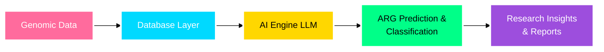
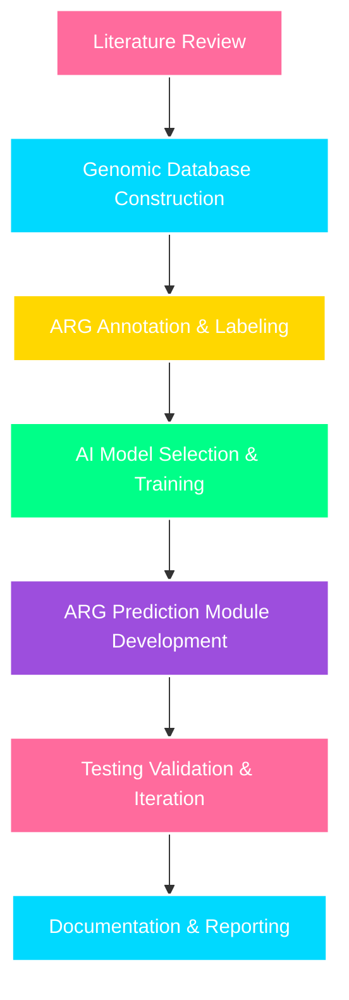

<div align="center">

# 🧬 Team NoEffort

### *Bridging Genomics, Artificial Intelligence, and Interactive Storytelling*


</div>

---

## Project Overview

### **LLM-Driven Framework for Antibiotic Resistance Gene (ARG) Analysis Using a Genomic Database**

<div align="center">
<br>



<br>
</div>

This final-year research project integrates **AI and genomic data** to analyze **antibiotic resistance genes (ARGs)**. The framework enables ARG detection, classification, and interpretation, providing actionable insights for researchers and students.

**Affiliation:** Genomic AI Research Lab (GARL)

---

## The Team

<div align="center">

<table>
  <tr>
    <td align="center" width="180">
      <a href="https://github.com/No-man1234">
        
      </a>
      <br><br>
      <b>Abdullah Al Noman</b>
      <br>
      <sub>0112230367</sub>
      <br>
      
    </td>
    <td align="center" width="180">
      <a href="https://github.com/neyamulhasan">
        
      </a>
      <br><br>
      <b>Kazi Neyamul Hasan</b>
      <br>
      <sub>0112230359</sub>
      <br>
      
    </td>
    <td align="center" width="180">
      <a href="https://github.com/mahathir58">
        
      </a>
      <br><br>
      <b>Mahathir Mohammad</b>
      <br>
      <sub>0112230889</sub>
      <br>
      
    </td>
  </tr>
  <tr>
    <td align="center" width="180">
      <a href="https://github.com/misbah7172">
        
      </a>
      <br><br>
      <b>Md. Habibulla Misba</b>
      <br>
      <sub>011221373</sub>
      <br>
      
    </td>
    <td align="center" width="180">
      <a href="https://github.com/rakibulhassan07">
        
      </a>
      <br><br>
      <b>Rakibul Hassan</b>
      <br>
      <sub>0112230362</sub>
      <br>
      
    </td>
    <td align="center" width="180">
    </td>
  </tr>
</table>

</div>

---

## Vision

<div align="center">

```
┌────────────────────────────────────────────────────────────────┐
│  "Transforming genetic data into actionable research insights" │
│              Making science accessible through AI               │
└────────────────────────────────────────────────────────────────┘
```

</div>

This project addresses **genomic data accessibility challenges** in Bangladesh and pioneers novel approaches to ARG analysis using AI.

### Core Objectives

<table>
<tr>
<td width="50%">

**Infrastructure Development**  
Establish a comprehensive, region-specific genomic database tailored to local research needs

**AI Integration**  
Deploy large language models for intelligent interpretation and query processing of ARG data

</td>
<td width="50%">

**Analysis & Reporting**  
Predict and classify ARGs, generate natural language summaries

**Knowledge Transfer**  
Create a framework that democratizes access to complex genomic information

</td>
</tr>
</table>

---

## Problem Space

<div align="center">

| Challenge | Our Solution |
|-----------|-------------|
| **Localized Data Gap** | Region-specific genomic database for Bangladesh |
| **Accessibility Barriers** | AI-powered interpretation for researchers and students |
| **Complexity** | Automated ARG detection and classification |
| **Engagement** | Interactive reports and visualizations for genomic data |

</div>

Genomic databases are fundamental to modern biological research, yet significant barriers persist. Our framework addresses these challenges through intelligent automation and creative engagement strategies, making cutting-edge genetic research accessible to everyone.

---

## Technical Architecture

### Technology Stack

<div align="center">


</div>

### System Components

<div align="center">

```
┌──────────────────────────────────────────────────────────────┐
│                                                              │
│  ┌─────────────┐    ┌─────────────┐    ┌─────────────┐    │
│  │  Database   │───▶│  AI Engine  │───▶│Visualization│    │
│  │   Layer     │    │   (LLM)     │    │& Reporting  │    │
│  └─────────────┘    └─────────────┘    └─────────────┘    │
│         │                   │                   │          │
│         └───────────────────┴───────────────────┘          │
│                         │                                  │
│                  ┌─────────────┐                           │
│                  │  API Layer  │                           │
│                  └─────────────┘                           │
│                                                              │
└──────────────────────────────────────────────────────────────┘
```

</div>

| Component | Description |
|-----------|-------------|
| **Database Layer** | Region-specific genomic repository storing sequences and ARG annotations |
| **AI Engine** | LLM for ARG prediction, classification, and interpretation |
| **Visualization & Reporting** | Interactive dashboards, tables, and natural language summaries |
| **API Infrastructure** | RESTful services for programmatic access and queries |

---

## Research Methodology

<div align="center">



</div>

Our development process follows rigorous academic standards, combining theoretical research with practical implementation and continuous refinement based on expert feedback and user testing.

---

## Development Roadmap

<div align="center">

| Phase | Focus Area | Status |
|-------|-----------|--------|
| **Phase 1** | Database Architecture & Data Acquisition |  |
| **Phase 2** | LLM Integration & Query System |  |
| **Phase 3** | ARG Prediction & Reporting Module |  |
| **Phase 4** | Testing & Refinement |  |
| **Phase 5** | Final Documentation & Presentation |  |

</div>

---

## Impact Potential

<table>
<tr>
<td width="50%" align="center">

### Academic Research
Provides local researchers with tailored genomic resources

### Education
Offers an engaging platform for genetics education

</td>
<td width="50%" align="center">

### Technology
Demonstrates practical AI applications in scientific contexts

### Healthcare
Supports public health initiatives through accessible genetic information

</td>
</tr>
</table>

---

## Acknowledgments

We extend our gratitude to our academic advisors, the Computer Science department, and the Genomic AI Research Lab for their guidance and support throughout this endeavor.

---

<div align="center">

### Team NoEffort | Final Year Design Project

**Computer Science Department** | **UIU**-223

[](#)
[](#)
[](#)
[](#)

---

*Made with passion by Team NoEffort*

</div>
